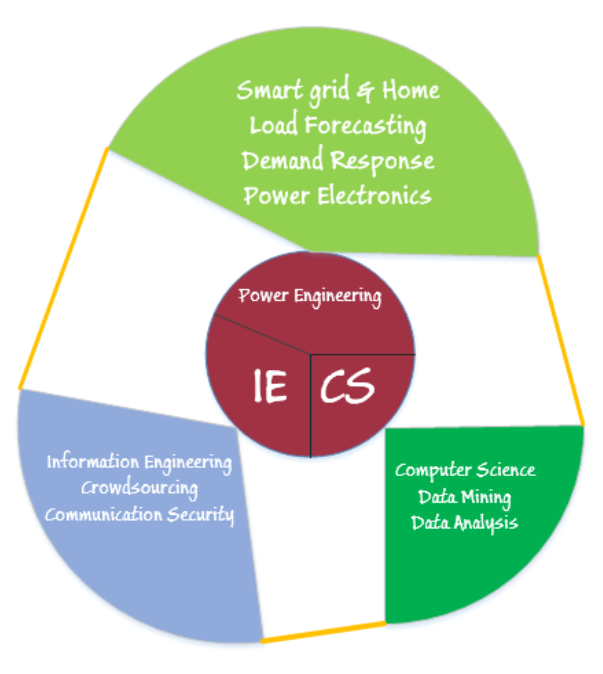

## Graduate 
I am doing the container technology on cloud platform to improve the resource utilization and work performance. There are some lab guides about docker and kubernetes. Note that all guides were made assume the readers have the fundamental linux system background, and know the [CloudLab](https://cloudlab.us/).

### Docker
* YARN with docker container test
Here I test the different version of hadoop-docker images, and solve the possible error. See [Hadoop-Docker](Hadoop-Docker.pdf).

* Catch the docker container logs 
There are many containers to start at the same time while running hadoop applications. So I write a report use netcat to show how to measure the life cycle of hadoop contaniers and get the logs. [Container](Container-log.pdf).

### Kubenetes 
* Kubenetes Cluster
I set up the kubenetes cluster on Cloudlab, note that kubernets is still under active development. [Kube-cluster](kube-cluster.pdf).

### Cloudlab
* Cloud set
I give specific details about how initilize the machine image for starters on Cloudlab, and use the installation of docker hadoop as example. [Cloudlab-install](Cloudlab-install.pdf).

---

## Undergraduate
As a student of IEEE Class, I was privileged to research under the direction of respectful and brilliant professors from varied fields of ECE, Since I was a freshman in Mar,2013. My past concerned with interdisciplinary across the fields of electric power system and information technology. You can get more about my academic development from [here](More about undergraduate.pdf).

### Electrical Power System & Electronics
* Power Operation & Market

Under the direction of Prof. ChuanWen Jiang, I currently occupied with short-term load forecasting by using Data Mining, based on the development state of one town. I try to dig a mechanism between economic component and load consuming of one town when making generation plan. And the idea struck me when I participated in the research project,"Modeling and Application of Transition of Dual Economics in Henan State Grid", supported by National State Grid of Henan Province.

* Three-Phase Grid-Connected Inverter of PV

At the begining of 2015, I joined the laboratory led by Prof. Yong Wang, to get some primary experience of power electronics. I am working on a new topology based on traditional three-level neutral-point clamped inverter theory and confirm it in practice, as a sub-project of the project "A study of Self-adaptive Digital drive of Multi-MW Wind Power Converters"supervised by Prof.Wang of NSF China. The new topology expects to improve the working efficiency and eliminate the dead interval.

### Information & Computer Science
* Crowd-Sourcing

Taking the professional course Wireless Communications: Principles and Applications, guided by Prof. Xinbing Wang &Prof. Xiaohua Tian. I have been occupied in the study of crowd-sourcing on wireless mobile application guided by Prof.Tian. The reason I choose the topic is the willing to touch more maths and fundamental theory, which also help me in data analysis to some content. What I do now is estimating the current incentive mechanism in crowd-sourcing and try to figure a novel way to perform high-quality & cost-efficiency both. 

* Security of Smart metering

I also take Computer Network,for the interest in the lesson itself and its mentor Prof. Weijia Jia, too. I think the technology of information and computer science is a auxiliary tool for the power system and the power engineers and researchers could learn from it but not to lose the attribute of power systems itself. As a good chance to get the tough warm-up,I have full enthusiasm working on the cyber security of smart grid, mainly concern on the Advanced Metering Infrastructure (AMI). To be more precise, I just focus on the communication of smart meter. What a magic thing from scientist. I want to get some idea of communication protocol concerns with security and privacy of metering data on smart meter's communication. 

